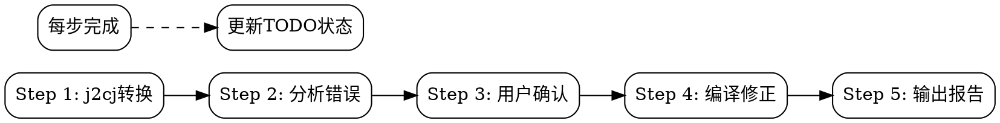

# Java to Cangjie Translation

Java到仓颉代码翻译技能，集成j2cj工具和完整文档，支持任务持久化和断点续传。

## When to Use

- 将Java项目/文件翻译为Cangjie
- 配置j2cj翻译选项 (mode, classpath等)
- 修复j2cj翻译后的编译错误
- **恢复中断的翻译任务**
- 查找Cangjie等效API和语法

## Quick Start

### 方式一：自动化工作流（推荐）

```bash
# 一键完成翻译、分析、生成Adapter
python3 scripts/j2cj_workflow.py ./java/src -o ./cangjie_output

# 带外部依赖
python3 scripts/j2cj_workflow.py ./java/src -o ./output -cp "./lib/*"
```

**生成内容：**
- `error_analysis_report.md` - 错误分析报告（表格形式）
- `adapters/*.cj` - Adapter stub类
- `adapters.cjmap` - cjmap映射文件

详见 [automation](subskills/automation/SKILL.md) skill

### 方式二：手动执行

```bash
# 基本翻译
java --patch-module jdk.compiler=j2cj_tool/j2cj.jar \
  -m jdk.compiler/com.excelsior.j2cj.main.Main \
  -d ./cangjie_output --mode codestyle ./java/src/*.java

# 带classpath翻译
java --patch-module jdk.compiler=j2cj_tool/j2cj.jar \
  -m jdk.compiler/com.excelsior.j2cj.main.Main \
  -d ./cangjie_output -cp ./lib/* --mode codestyle ./java/src/*.java
```

**Translation Modes**:
- `codestyle`: 生成符合Cangjie习惯的代码（推荐）
- `semantic`: 保持Java原有语义

## 任务持久化

**每个翻译任务自动创建TODO清单，支持中断后恢复：**

```
=== Java2Cangjie 翻译任务 ===
当前步骤: Step 4.3 (编译修正)
已完成: j2cj转换, 错误分析, 用户确认
待完成: 编译修正 (3/6 文件), 生成报告
```

**Checkpoint文件位置**: `<output_dir>/.java2cangjie_checkpoint.md`

**恢复中断任务**:
```
继续修复 UserService.cj
```

详见 [checkpoint模板](templates/checkpoint.md)

## Workflow Overview

**强制执行5步流程** (详见 [workflow](subskills/workflow/SKILL.md)):



## Sub-Skills

| Skill | 用途 |
|-------|------|
| [workflow](subskills/workflow/SKILL.md) | 5步翻译流程 + TODO追踪 |
| [compilation](subskills/compilation/SKILL.md) | 编译修正 + 文件级TODO |
| [reference](subskills/reference/SKILL.md) | 文档查找和错误修正 |
| [automation](subskills/automation/SKILL.md) | **一键自动化工作流** (推荐) |

## ⚠️ 仓颉编译器目录规则

**重要：如果一个目录没有 `.cj` 文件，它的子目录不会被编译！**

```
src/
├── empty.cj              ← 确保 src/ 被识别
├── mappings/
│   ├── empty.cj          ← 确保 mappings/ 被识别
│   ├── io/               ← 依赖父目录有 .cj 文件
│   └── lang/
└── utils/
```

**解决方案**：在每个中间目录放置 `empty.cj` 文件：
```cangjie
// src/empty.cj
package mypackage

// src/mappings/empty.cj
package mypackage.mappings
```

**注意**：j2cjlib 中的 `empty.cj` 文件不可删除，否则子目录将无法编译。

## 🚫 j2cj输出保护规则

**j2cj工具转换后生成的目录结构和配置文件禁止修改！**

j2cj转换会自动生成：
- `cjpm.toml` - 项目构建配置
- 目录结构（包括 `empty.cj` 占位文件）

**禁止操作**：
- ❌ 修改 `cjpm.toml` 内容
- ❌ 删除或移动 `empty.cj` 文件
- ❌ 重命名或重组目录结构
- ❌ 添加新的目录层级

**允许操作**：
- ✅ 修改 `.cj` 源文件内容（修复编译错误）
- ✅ 在 `adapters/` 目录下添加外部依赖mock

**原因**：j2cj生成的目录结构和配置经过验证，修改可能导致编译失败或包依赖问题。

## Common Mappings

| Java | Cangjie |
|------|---------|
| `ArrayList<E>` | `std.collection.ArrayList<E>` |
| `HashMap<K,V>` | `std.collection.HashMap<K,V>` |
| `Optional<T>` | `Option<T>` |
| `null` | `None` 或可空类型 |
| `try/catch` | `try/except` |

## Resources

- **j2cj_tool/**: j2cj.jar + 依赖库
- **docs/**: Cangjie完整文档 (extra/, libs/std/, manual/)
- **references/**: 文档索引 (packages_index.md, extra_index.md)
- **templates/**: Checkpoint模板
- **scripts/**: 工具脚本

## 自动生成Stub工具

**从错误标记自动生成Cangjie stub类和cjmap映射：**

```bash
# 使用一体化工作流（推荐）
python3 scripts/j2cj_workflow.py ./java/src -o ./cangjie_output

# 或仅分析已有输出
python3 scripts/j2cj_workflow.py ./java/src -o ./cangjie_output --skip-translate
```

**生成的文件结构：**
```
cangjie_output/
├── cjpm.toml                  # 主项目配置
├── error_analysis_report.md   # 错误分析报告
├── adapters.cjmap             # cjmap映射规则
├── net/                       # j2cj生成的代码
│   └── src/net/...
└── adapters/                  # Adapter模块
    ├── cjpm.toml
    └── src/adapters/java/
        ├── io/
        │   └── OutputStream.cj
        └── lang/
            └── System.cj
```

**使用步骤：**
1. 运行工作流脚本
2. 查看错误报告了解缺失映射
3. 将adapters模块添加为依赖
4. 运行 `cjpm build` 验证编译
