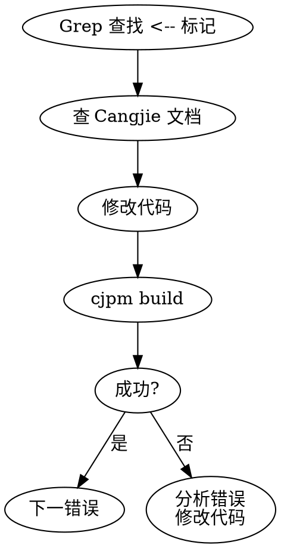

# Java to Cangjie Translation

使用 j2cj 工具将 Java 代码翻译为仓颉 (Cangjie)，并修复翻译错误。

## Quick Start

```bash
# 1. 生成文件列表
find src -name "*.java" > /tmp/files.txt

# 2. 执行翻译
java --patch-module jdk.compiler=j2cj_tool/j2cj.jar \
     -m jdk.compiler/com.excelsior.j2cj.main.Main \
     -d ./cangjie_output -mode codestyle \
     @/tmp/files.txt

# 3. 找到 cjpm.toml 位置并编译
find ./cangjie_output -name "cjpm.toml"
cd ./cangjie_output/<root_package> && cjpm build
```

## Core Rules

### ⚠️ j2cj 命令注意事项
| 问题 | 错误 | 正确 |
|------|------|------|
| 参数格式 | `--mode codestyle` | `-mode codestyle` |
| 文件指定 | `*.java` 或 `**/*.java` | `@/tmp/files.txt` |
| 工作目录 | 任意目录 | 目标项目根目录 |

### 🔴 编译目录规则
cjpm 命令必须在包含 `cjpm.toml` 的目录执行：
```
cangjie_output/
└── net/              # ← 根包目录
    ├── cjpm.toml     # ← 在这里执行 cjpm build
    └── src/...
```

## Error Fix Workflow



### 修复循环（必须严格执行）
1. **每次修改后立即编译** - 禁止批量修改
2. **检查 exit code** - `echo $?`（0 = 成功）
3. **记录完整错误** - 用于分析

## Common Errors & Fixes

| 错误标记 | 原因 | 解决方案 |
|----------|------|----------|
| `Missing mapping for java.util.Collections` | 无直接映射 | 使用 Cangjie 对应 API |
| `Java keyword 'synchronized' not supported` | 语法不支持 | 使用 ReentrantLock |
| `Generic wildcard '? extends T'` | 泛型差异 | 改写为具体类型 |

### 文档查找路径
```
docs/
├── extra/          # ArrayList, HashMap, Option 等
├── libs/std/       # 标准库 API
└── manual/         # 语法特性
```

## When NOT to Use

- 纯 Cangjie 开发（无 Java 源码需要翻译）
- 代码分析（非翻译场景）
- 非 j2cj 工具的翻译任务

## Common Mistakes

1. **使用 `--mode`** → 应该用 `-mode`（单横线）
2. **使用通配符 `*.java`** → 必须用 `@filelist` 方式
3. **在错误目录执行 cjpm** → 必须在 `cjpm.toml` 所在目录
4. **批量修改后编译** → 必须 修改→编译→检查 循环

## Resources

- `j2cj_tool/j2cj.jar` - 翻译工具 (J2CJ 1.7.99)
- `j2cj_tool/j2cj-user-guide-zh.pdf` - 用户指南
- `docs/` - Cangjie 语言文档
- **详细工作流**: 见 [workflow.md](./workflow.md)
