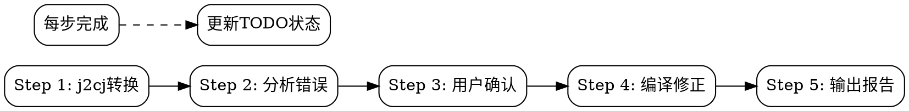

# Java to Cangjie Translation

Java到仓颉代码翻译技能，集成j2cj工具和完整文档，支持任务持久化和断点续传。

## When to Use

- 将Java项目/文件翻译为Cangjie
- 配置j2cj翻译选项 (mode, classpath等)
- 修复j2cj翻译后的编译错误
- **恢复中断的翻译任务**
- 查找Cangjie等效API和语法

## Quick Start

```bash
# 基本翻译
java --patch-module jdk.compiler=j2cj_tool/j2cj.jar \
  -m jdk.compiler/com.excelsior.j2cj.main.Main \
  -d ./cangjie_output --mode codestyle ./java/src/*.java

# 带classpath翻译
java --patch-module jdk.compiler=j2cj_tool/j2cj.jar \
  -m jdk.compiler/com.excelsior.j2cj.main.Main \
  -d ./cangjie_output -cp ./lib/* --mode codestyle ./java/src/*.java
```

**Translation Modes**:
- `codestyle`: 生成符合Cangjie习惯的代码（推荐）
- `semantic`: 保持Java原有语义

## 任务持久化

**每个翻译任务自动创建TODO清单，支持中断后恢复：**

```
=== Java2Cangjie 翻译任务 ===
当前步骤: Step 4.3 (编译修正)
已完成: j2cj转换, 错误分析, 用户确认
待完成: 编译修正 (3/6 文件), 生成报告
```

**Checkpoint文件位置**: `<output_dir>/.java2cangjie_checkpoint.md`

**恢复中断任务**:
```
继续修复 UserService.cj
```

详见 [checkpoint模板](templates/checkpoint.md)

## Workflow Overview

**强制执行5步流程** (详见 [workflow](subskills/workflow/SKILL.md)):



## Sub-Skills

| Skill | 用途 |
|-------|------|
| [workflow](subskills/workflow/SKILL.md) | 5步翻译流程 + TODO追踪 |
| [compilation](subskills/compilation/SKILL.md) | 编译修正 + 文件级TODO |
| [reference](subskills/reference/SKILL.md) | 文档查找和错误修正 |

## Common Mappings

| Java | Cangjie |
|------|---------|
| `ArrayList<E>` | `std.collection.ArrayList<E>` |
| `HashMap<K,V>` | `std.collection.HashMap<K,V>` |
| `Optional<T>` | `Option<T>` |
| `null` | `None` 或可空类型 |
| `try/catch` | `try/except` |

## Resources

- **j2cj_tool/**: j2cj.jar + 依赖库
- **docs/**: Cangjie完整文档 (extra/, libs/std/, manual/)
- **references/**: 文档索引 (packages_index.md, extra_index.md)
- **templates/**: Checkpoint模板
