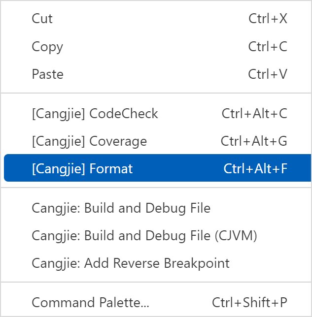
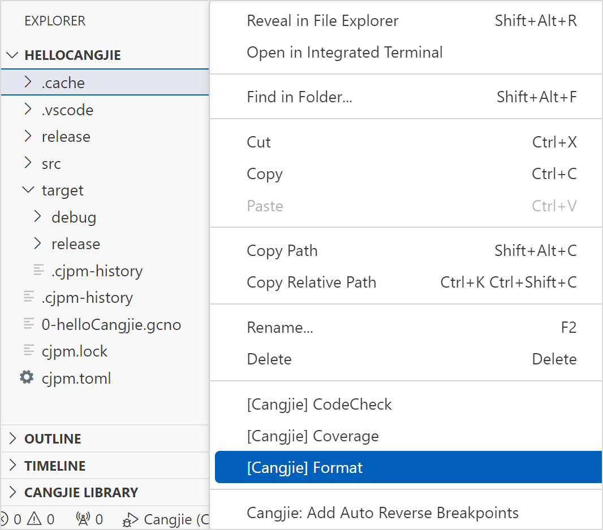
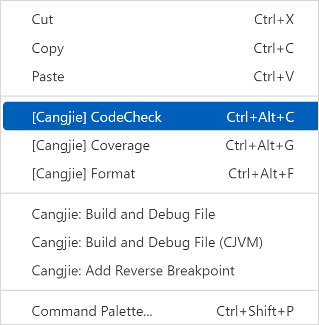
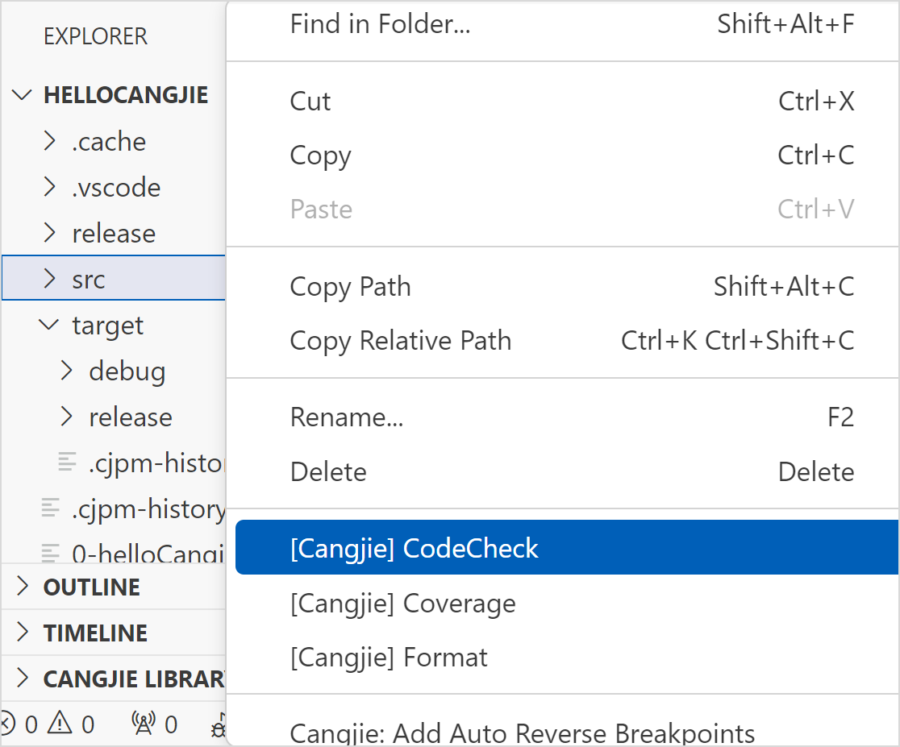
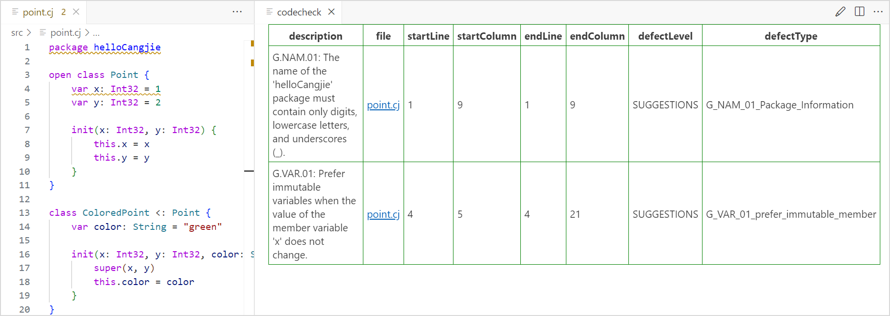
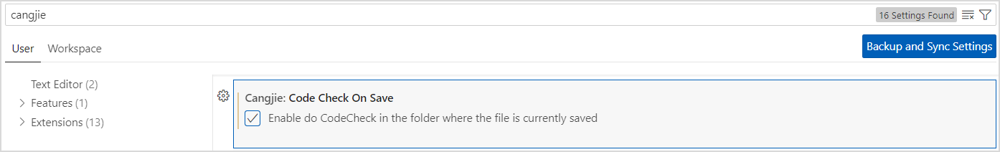
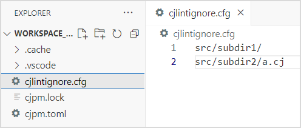
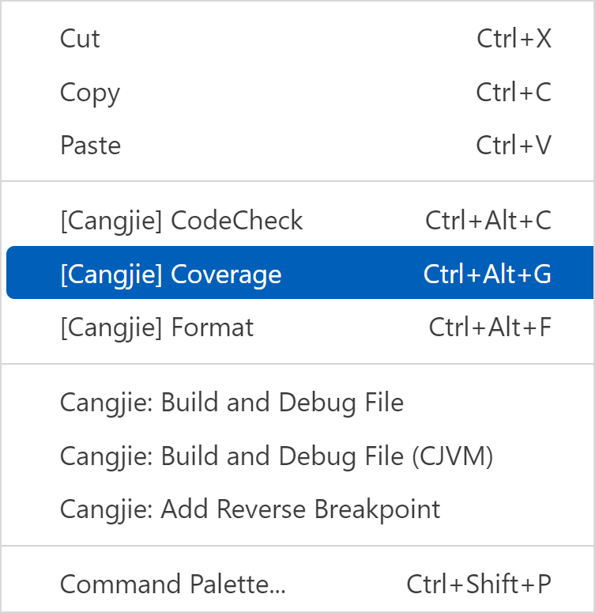
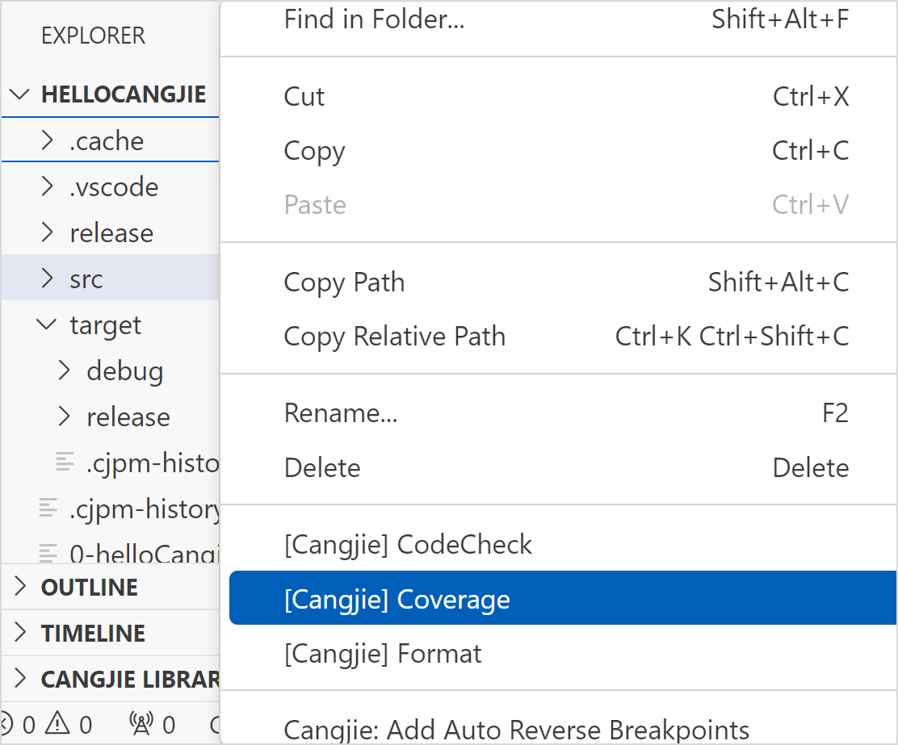

# 命令行工具集成

> **说明：**
>
> 本文档部分图片截取于 VSCode 软件界面，仅用于说明仓颉插件在 VSCode 中的使用方法。

## 格式化

针对仓颉文件，在 VSCode 的代码编辑区右键选择 [Cangjie] Format 或用快捷键 Ctrl + Alt + F 执行格式化命令，可以对当前仓颉文件进行格式化。如下图所示。

针对仓颉项目，支持在 VSCode 的资源管理器中选择文件或右键单击文件夹执行 [Cangjie] Format 命令，对选择的文件或者文件夹进行格式化。如下图所示。

## 静态检查

IDE 中的静态检查功能基于静态检查工具 cjlint，该功能可以识别代码中不符合编程规范的问题，帮助开发者发现代码中的漏洞，写出满足 Clean Source 要求的仓颉代码。

> **说明：**
>
> 静态检查目前只能检测工程目录 src 文件夹下的所有仓颉文件。

静态检查的入口有两处:

- 在 VSCode 的代码编辑区右键选择 [Cangjie] CodeCheck 或用快捷键 Ctrl + Alt + C 执行静态检查命令，如下图所示。

    

- 在 VSCode 的资源管理器处右键选择 [Cangjie] CodeCheck 执行静态检查命令，如下图所示。

    

执行静态检查命令后，如果有不符合编码规范的问题，会展示在右侧的表格中。单击表格中的文件链接，可以跳转到问题代码所在文件的行列。

当前支持代码保存后自动触发静态检查：

开发者可以通过点击左下角齿轮图标，选择设置选项，在搜索栏输入 cangjie，找到 Code Check On Save 选项，勾选该选项，即可开启自动触发静态检查。如下图：

开启自动静态检查后会在项目根目录生成一个 cjlintignore.cfg 配置文件，配置文件中可支持三类屏蔽方式，包括屏蔽文件、文件夹和正则表达式。每条配置项为相对该配置文件所在目录的相对路径（支持正则），无需双引号包含，自动静态检查支持将配置项匹配的仓颉文件屏蔽，不会产生关于这些文件的告警。例如在 cjlintignore.cfg 中有以下配置，则自动静态检查会将 src/subdir1/ 目录和 src/subdir2/a.cj 文件加入屏蔽。

## 覆盖率统计

覆盖率统计功能用于生成仓颉语言程序的覆盖率报告。

> **注意：**
>
> 当选择的文件夹中不含有仓颉文件时，将不会生成覆盖率报告。

覆盖率统计的入口有两处:

- 在 VSCode 的代码编辑区右键选择 [Cangjie] Coverage 或用快捷键 Ctrl + Alt + G 执行生成当前仓颉文件覆盖率报告的命令，如下图所示。

    

- 在 VSCode 的资源管理器中选择文件或右键单击文件夹执行 [Cangjie] Coverage 命令，对选择的文件或者文件夹生成覆盖率报告，如下图所示。

    

在生成的覆盖率报告页面，可以单击文件名查看覆盖率详情。
