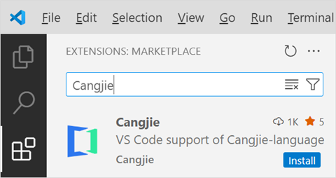
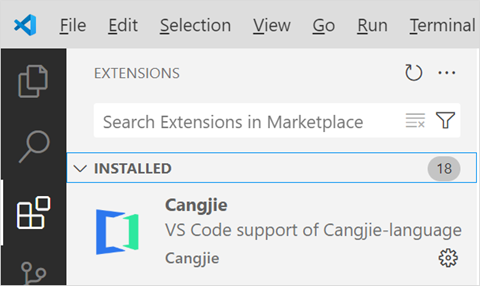
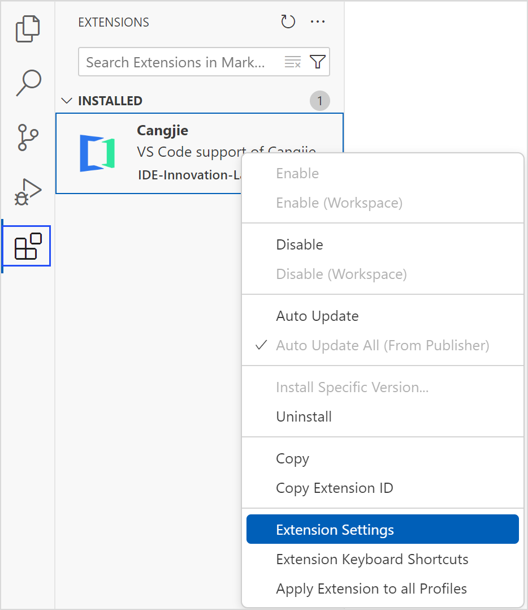
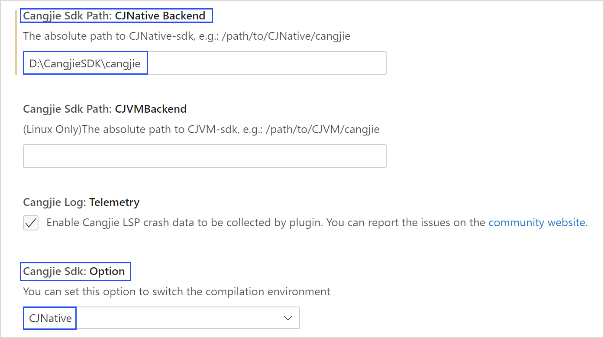

# 安装指导

> **说明：**
>
> 本文档部分图片截取于 VSCode 软件界面，仅用于说明仓颉插件在 VSCode 中的使用方法。

## 下载软件

请在 VSCode 官网下载 VSCode 安装包，建议使用 1.67 或更新版本。仓颉语言 VS Code 插件已上架 VS Code 扩展市场，可以前往[仓颉下载中心](https://cangjie-lang.cn/download)，点击**Cangjie vscode plugin**下面的**立即查看**，可以跳转到 VSCode 扩展市场进行安装，或在 VSCode 内部扩展界面直接进行安装。

| 下载项 | 说明 | 是否必选 |
| ------------ | ------------ | ------------ |
| Visual Studio Code | IDE | 必选 |

## 安装 VSCode

### Windows 平台

运行 VSCode 安装文件（例如 VSCodeUserSetup-x64.exe），根据提示选择安装路径，完成 VSCode 的安装。

### Linux 平台

#### 本地安装

参考 VSCode 官网安装适合的 Linux 发行版的 VSCode。

#### 远程安装

1. 在 VSCode 中搜索并安装 Remote - SSH 插件。

2. 使用 Remote - SSH 进行远程工作，VSCode 会自动在远程主机上安装 Server。linux_arm64 暂时只支持使用 Remote - SSH 的方式进行操作。

### macOS 平台

解压下载的压缩包（例如 VSCode-darwin-universal.zip），将解压后的 .app 文件拖拽到应用程序，完成 VSCode 的安装。

## 安装仓颉插件

仓颉插件可以通过 VSCode 扩展市场直接安装。

1. 启动 VSCode。

2. 点击左侧边栏的扩展图标进入扩展市场（或按 Ctrl+Shift+X/Cmd+Shift+X）。

   

3. 搜索插件仓颉，在搜索栏输入关键词**Cangjie**，找到**Cangjie**插件后，点击 Install 按钮安装。

   

4. 已经安装的插件可以在 INSTALLED 目录下查看。

   

## 安装仓颉 SDK

仓颉 SDK 主要提供了仓颉语言编译命令（cjc）、仓颉语言官方包管理工具（Cangjie Package Manager，简称 CJPM），以及仓颉格式化工具（Cangjie Formatter，简称 cjfmt）等命令行工具。正确安装并配置仓颉 SDK 后，可使用工程管理、编译构建、格式化、静态检查和覆盖率统计等功能。开发者可以通过以下两种方式下载 SDK：

- 离线手动安装。在官网下载 SDK 安装包，并在本地安装部署仓颉 SDK。
- 通过 VSCode 安装。仓颉插件提供了仓颉 SDK 最新版本的下载和更新功能，开发者可以在 VSCode 完成最新版本仓颉 SDK 的下载和本地环境部署。

### 下载 SDK

开发者可以自行前往[仓颉下载中心](https://cangjie-lang.cn/download)，手动下载仓颉 SDK。

#### Windows 平台

Windows 平台的 SDK 下载内容为：`cangjie-sdk-windows-x64-x.y.z.exe` 或 `cangjie-sdk-windows-x64-x.y.z.zip`。

下载 SDK 并放置在本地。若下载 .exe 文件，运行该文件，根据提示选择安装路径并记录该路径。若下载 .zip 文件，解压该文件，记录存储的路径。

SDK 文件夹的目录结构如下：

```text
cangjie

├── bin

├── lib

├── modules

├── runtime

├── third_party

├── tools

├── envsetup.bat

├── envsetup.ps1

└── envsetup.sh
```

#### Linux 平台

Linux_x64 平台的 SDK 下载内容为：`cangjie-sdk-linux-x64-x.y.z.tar.gz`。

Linux_AArch64 平台的 SDK 下载内容为：`cangjie-sdk-linux-aarch64-x.y.z.tar.gz`。

下载 SDK 并放置在本地，记录存储的路径。目录结构如下：

```text
cangjie

├── bin

├── include

├── lib

├── modules

├── runtime

├── third_party

├── tools

└── envsetup.sh
```

#### macOS 平台

macOS_AArch64 平台的 SDK 下载内容为：`cangjie-sdk-mac-aarch64-x.y.z.tar.gz`。

下载 SDK 并放置在本地，记录存储的路径。目录结构如下：

```text
cangjie

├── bin

├── lib

├── modules

├── runtime

├── third_party

├── tools

└── envsetup.sh
```

### SDK 路径配置

安装完仓颉插件后，即可配置 SDK 的路径。单击左下角齿轮图标，选择设置选项。


或直接右键单击插件，选择 Extension Settings，进入配置页面。



在搜索栏输入 Cangjie，选择侧边栏的 Cangjie Language Support 选项。


**配置 CJNative 后端**

1. 找到 Cangjie Sdk: Option 选项，选择后端类型为 CJNative（默认是此选项）。

2. 找到 Cangjie Sdk Path: CJNative Backend 选项，输入 CJNative 后端 SDK 文件夹所在绝对路径。

3. 重启 VSCode 生效。



### 安装验证

通过快捷键 Ctrl + Shift + P（macOS 系统的快捷键为 Command + Shift + P） 调出 VSCode 的命令面板，选择 cangjie: Create Cangjie Project View 命令。


弹出创建仓颉项目页面，说明仓颉 SDK 安装成功。


