# 语言服务

> **说明：**
>
> 本文档部分图片截取于 VSCode 软件界面，仅用于说明仓颉插件在 VSCode 中的使用方法。

语言服务工具为开发者提供如下功能：语法高亮、自动补全、定义跳转、查找引用、诊断报错、选中高亮、悬浮提示、签名帮助和重命名等。

> **说明：**
>
> - **项目根目录 (PROJECTROOT)**：仓颉语言服务插件以开发者当前打开的文件夹作为项目根目录 PROJECTROOT，且仅对该目录下的仓颉源码提供语言服务支持。
> - **模块命名**：如如未显式指定模块名称，默认将项目根目录 PROJECTROOT 名称作为模块名，便于导入 src 目录下的包。
> - **源码支持范围**：PROJECTROOT/src 下称为**src 下仓颉源码**（支持语言服务）；除了 **src 下仓颉源码**，项目根目录 PROJECTROOT 下的其他所有源码称为**非 src 下仓颉源码**（支持语言服务）；项目根目录 PROJECTROOT 之外的仓颉源码称为**外部源码**（暂不支持语言服务）。
> - **导入能力**：**非 src 下仓颉源码**中，每个文件夹都作为一个包，包名的声明和包的编译方式与**src 下仓颉源码**顶层包（即 default 包）处理方式保持一致。**非 src 下仓颉源码**可以导入标准库的包以及**src 下仓颉源码**中自定义的包，**非 src 下仓颉源码**的包无法被其他包导入。
> - **宏展开依赖**：仓颉语言服务的宏展开依赖宏的动态库，如果涉及自定义宏展开的代码，需要先编译出动态库，然后再启动语言服务。

## 代码高亮

VSCode 打开仓颉工程中的 .cj 文件，即可看到代码高亮效果。VSCode 不同主题显示的代码高亮颜色不同，支持对代码运算符、类、注释、函数、关键字、数字、包名、字符串、变量等进行高亮显示。

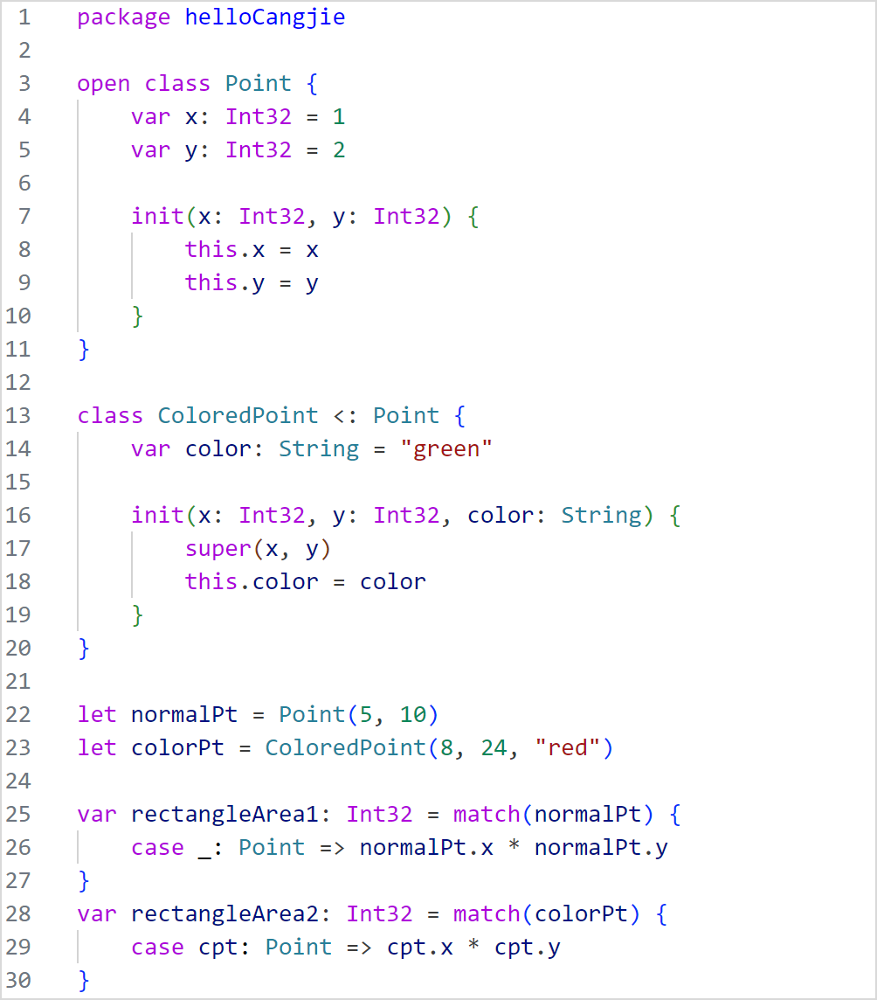

## 自动补全

VSCode 打开仓颉工程中的 .cj 文件，输入关键字、变量或 . 符号，在光标右侧提示候选内容。可以用上下方向键快速选择想要的内容（需要切换为系统默认输入法），使用 Enter 键或 Tab 键补全。

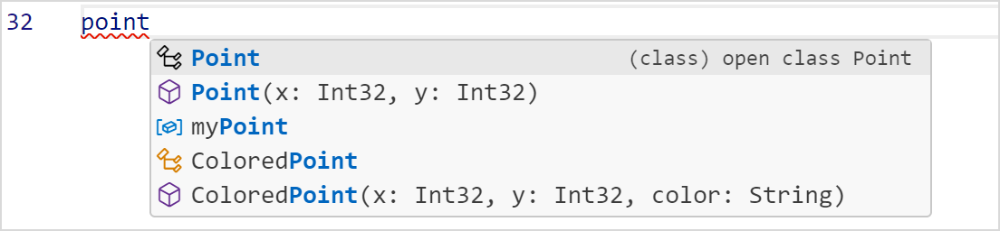

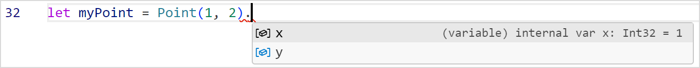

对于带参数的函数或者泛型提供模块化补齐，即当函数有参数或者带泛型时，选择函数补齐项之后会出现参数格式化补齐，如下图所示。填充数值之后按下 Tab 键可以切换到下一个参数补齐，直至模块化补齐结束，或按下 Esc 键提前退出除当前选中模块。

## 定义跳转

VSCode 打开仓颉工程中的 .cj 文件，鼠标悬停在目标上方，按下 Ctrl 键并单击鼠标左键触发定义跳转；或使用鼠标右键单击目标符号，选择 Go to Definition 执行定义跳转；或按下快捷键 F12 执行定义跳转。

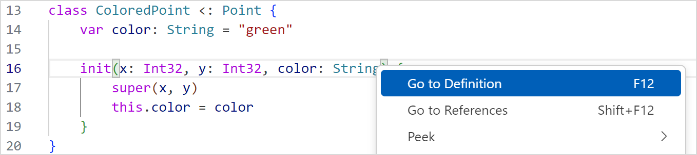

> **说明：**
>
> 在符号使用的地方使用定义跳转会跳转到符号定义处，支持跨文件跳转。
> 在符号定义处使用定义跳转，如果此符号没被引用过，光标会跳转到符号左端。
> 如果符号在其他地方被引用，会触发查找引用。

## 查找引用

VSCode 打开仓颉工程中的 .cj 文件，使用鼠标右键单击目标符号，选择 Find All References 执行符号引用预览，单击预览条目，可以跳转到对应引用处。

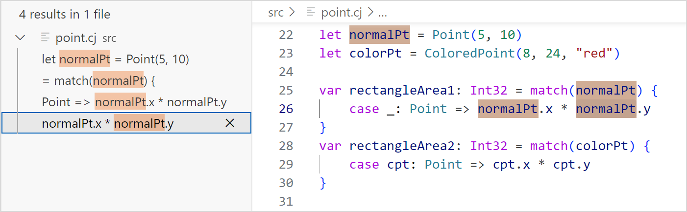

## 诊断报错

VSCode 打开仓颉工程中的 .cj 文件，当源码文件出现不符合仓颉语法或语义规则的代码时，会在相关代码段出现红色波浪下划线，如下图所示，当鼠标悬停在上面，可以提示相应的报错信息。修改正确后，诊断报错自行消失。

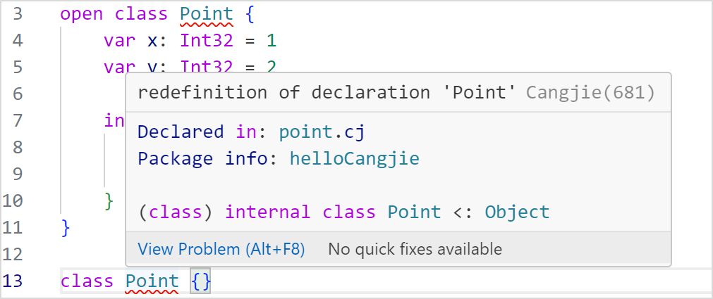

## 选中高亮

VSCode 打开仓颉工程中的 .cj 文件，光标定位在一个变量或函数名处，当前文件中该变量的声明处以及其使用处都会高亮显示。

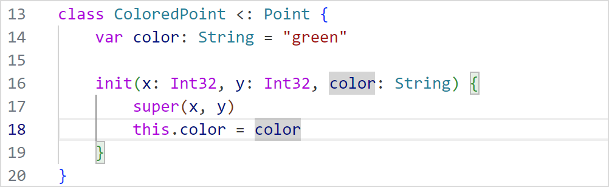

## 悬浮提示

VSCode 打开仓颉工程中的 .cj 文件，光标悬浮在变量处，可以提示类型信息。

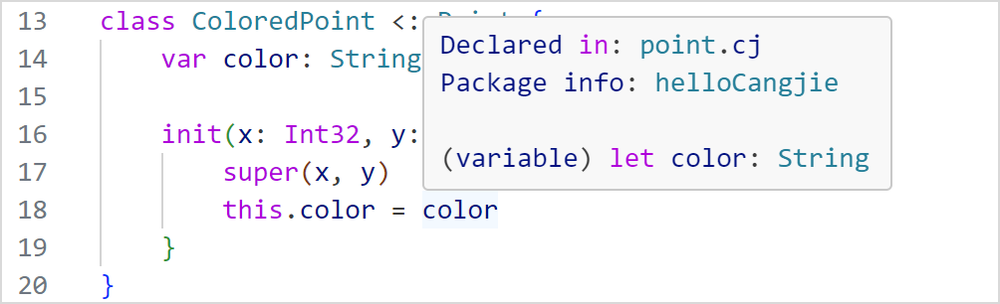

悬浮在函数名处，可以提示函数原型。

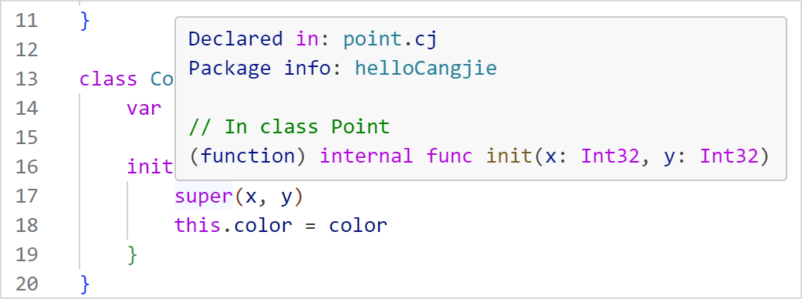

## 定义搜索

VSCode 打开仓颉工程中的 .cj 文件，同时按下 Ctrl 键和 T 键，弹出搜索框，输入想要搜索的符号定义名，会显示出符合条件的搜索结果。单击搜索结果条目，可以跳转到对应的定义位置处。

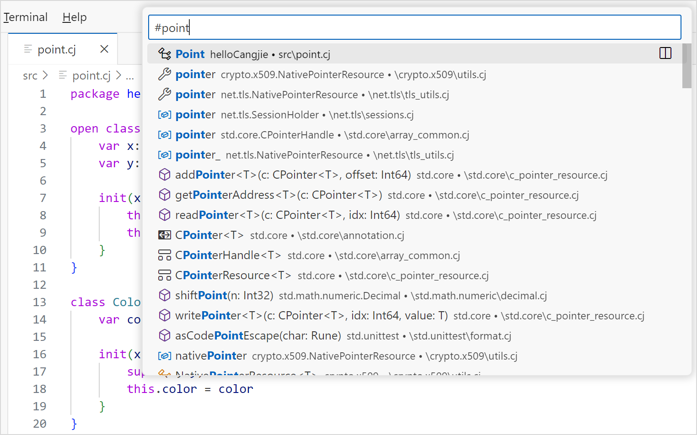

目前支持搜索的定义类型有：class、interface、enum、struct、typealias、toplevel 的函数、toplevel 的变量、prop、enum 构造器、成员函数和成员变量。

## 重命名

VSCode 打开仓颉工程中的 .cj 文件，光标定位在想要修改的自定义名称上，右键选择 Rename Symbol 或按下快捷键 F2 打开重命名编辑框。

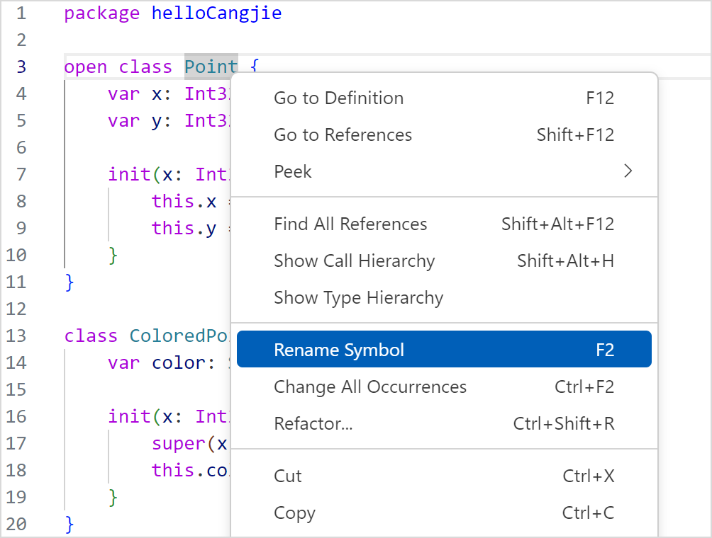

编辑完毕按下回车键，完成重命名的实现。

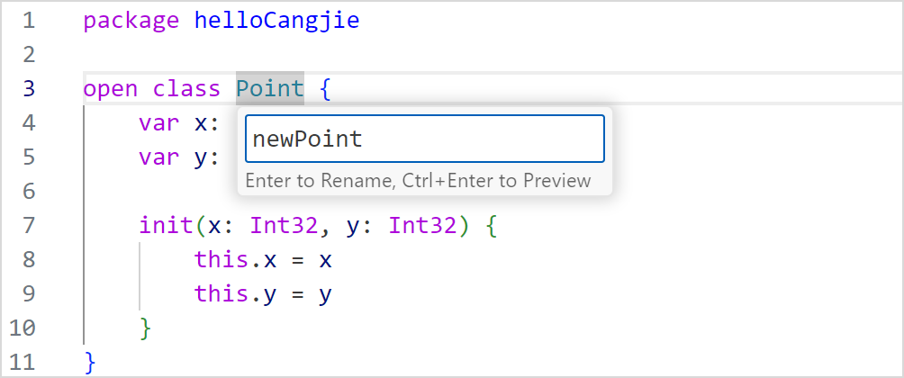

目前支持重命名的类型有：class、interface、enum、struct、func、type、泛型、变量和自定义宏。

## 大纲视图显示

VSCode 打开仓颉工程中的 .cj 文件，在左侧 OUTLINE 视图中显示当前文件的大纲。目前支持两层结构的显示，第一层主要为 toplevel 中定义的声明，第二层主要为构造器及成员。

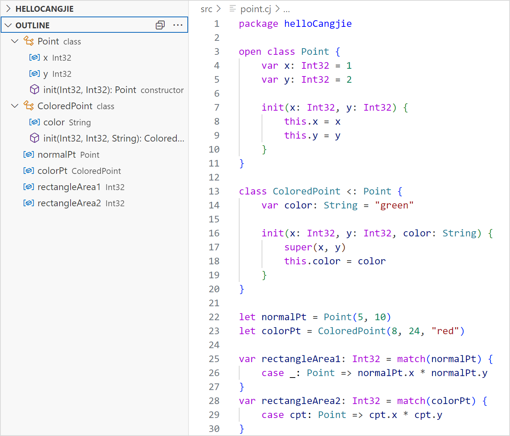

目前支持大纲视图显示的类型有：class、interface、enum、struct、typealias、toplevel 的函数、toplevel 的变量、prop、enum 构造器、成员函数和成员变量。

## 面包屑导航

VSCode 打开仓颉工程中的任意 .cj 文件，光标定位在符号处，点击面包屑导航，显示符号当前所处的位置，以及该符号在整个工程中的位置路径。

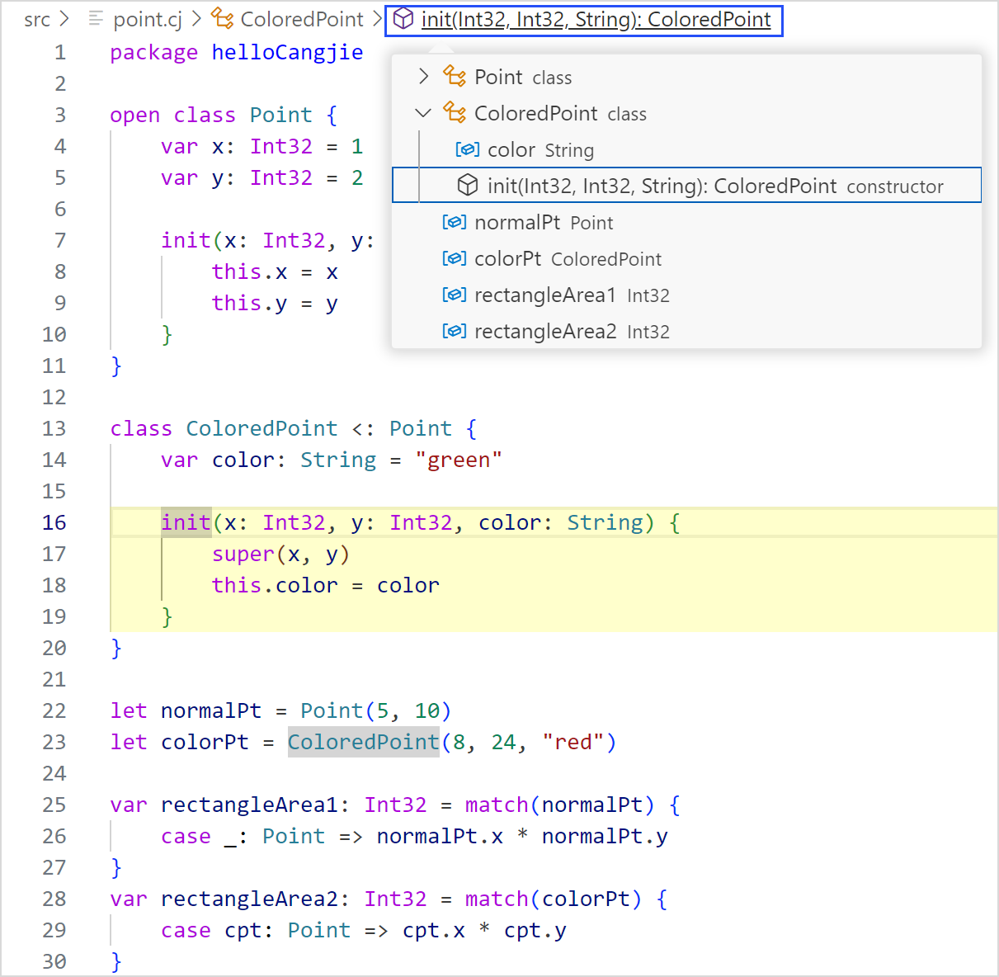

目前支持面包屑导航的类型有：class、interface、enum、struct、typealias、toplevel 的函数、toplevel 的变量、prop、enum 构造器、成员函数和成员变量。

## 签名帮助

VSCode 在输入左括号和逗号时会触发签名帮助。触发后，只要还在函数参数范围内，提示框会一直随光标移动（可与补全共存）。如下图所示，开发者可以看到当前函数的参数信息，以及当前函数位置参数的高亮效果。

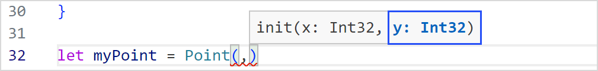

## 显示类型层次结构

VSCode 打开仓颉工程中的 .cj 文件，光标定位在想要查看的自定义名称上，右键选择 Show Type Hierarchy，在左侧就会显示该类型层次结构。Object 类型默认为所有类的父类，该功能下不会显示。

目前支持显示层次结构的类型有：class、interface、enum 和 struct。

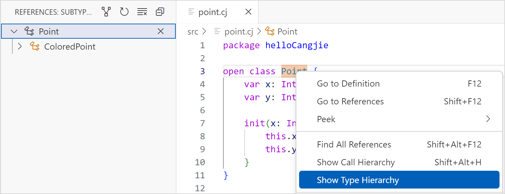

单击如图标记所示位置，可以在显示子类和父类之间切换。

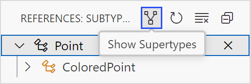

## 调用类型层次结构

VSCode 打开仓颉工程中的 .cj 文件，光标定位在函数名上，右键选择 Show Call Hierarchy，在左侧就会显示该函数的调用类型层次结构。

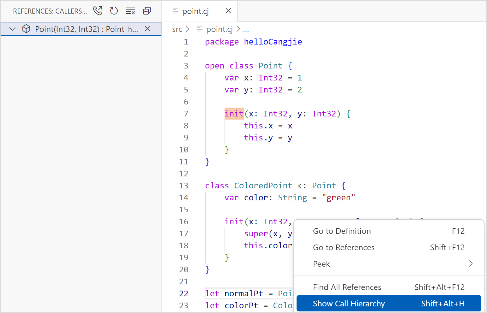

通过单击标识位置可以在显示调用函数和被调用函数之间切换。

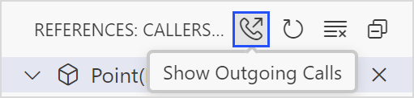
