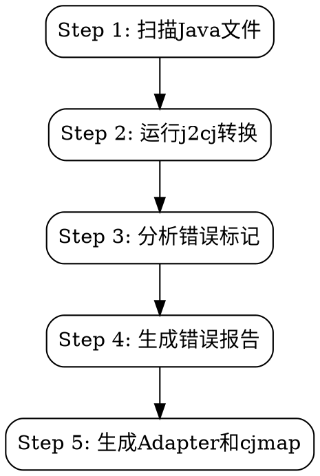

# j2cj 自动化工作流

完整的Java到Cangjie翻译自动化流程，一站式完成翻译、分析和stub生成。

## When to Use

- 首次翻译Java项目到Cangjie
- 需要自动化生成缺失API的stub实现
- 想要快速了解翻译后的错误分布

## Quick Start

```bash
# 一键执行完整工作流
python3 scripts/j2cj_workflow.py ./java/src -o ./cangjie_output

# 带classpath
python3 scripts/j2cj_workflow.py ./java/src -o ./output -cp "./lib/*"
```

## 工作流程



## Step 1: 扫描Java文件

**自动执行：**
- 递归扫描所有 `.java` 文件
- 解析包名和import语句
- 分析外部依赖需求

**输出：**
- Java文件清单
- 依赖分析结果

## Step 2: 运行j2cj转换

**自动执行：**
- 构建j2cj命令行
- 执行转换
- 保存转换日志

**命令示例：**
```bash
java --patch-module=jdk.compiler=j2cj_tool/j2cj.jar \
  -m jdk.compiler/com.excelsior.j2cj.main.Main \
  -d ./cangjie_output --mode=codestyle \
  ./java/src/**/*.java
```

**日志位置：** `<output_dir>/.j2cj_log.txt`

## Step 3: 分析错误标记

**扫描所有 `.cj` 文件中的错误标记：**

| 错误类型 | 标记格式 | 说明 |
|----------|----------|------|
| 缺失方法 | `<-- Missing mapping for java.xxx member: methodName -->` | API未映射 |
| 缺失构造函数 | `<-- Missing mapping for java.xxx constructor: ClassName -->` | 构造函数未映射 |
| 缺失字段 | `<-- Missing mapping for java.xxx static field: fieldName -->` | 静态字段未映射 |
| 无效符号 | `<-- Invalid symbol: xxx -->` | 第三方库调用 |

**分析输出：**
- 按Java类分组统计
- 计算使用频率
- 记录来源文件

## Step 4: 生成错误报告

**生成 `<output_dir>/error_analysis_report.md`**

### 1. 错误汇总表

| 序号 | Java类 | 方法数 | 构造函数数 | 字段数 | 总使用次数 |
|------|--------|--------|------------|--------|------------|
| 1 | `java.lang.Throwable` | 2 | 0 | 0 | 167 |
| 2 | `java.io.OutputStream` | 2 | 0 | 0 | 104 |
| 3 | `java.util.Collections` | 4 | 0 | 0 | 66 |

### 2. 详细错误列表

```markdown
### java.lang.Throwable

| 类型 | 成员名 | 使用次数 | 文件数 |
|------|--------|----------|--------|
| 方法 | `addSuppressed` | 166 | 15 |
| 方法 | `getCause` | 1 | 1 |
```

## Step 5: 生成Adapter和cjmap

### Adapter stub类

**位置：** `<output_dir>/adapters/` （独立模块）

**目录结构（与j2cj输出格式一致）：**
```
cangjie_output/
├── cjpm.toml                  # 主项目配置
├── net/                       # j2cj生成的代码
│   ├── cjpm.toml
│   └── src/net/...
├── adapters/                  # Adapter模块
│   ├── cjpm.toml              # Adapter模块配置
│   └── src/
│       └── adapters/
│           ├── empty.cj       # 确保目录被识别
│           └── java/
│               ├── io/
│               │   └── OutputStream.cj
│               └── lang/
│                   └── System.cj
└── adapters.cjmap             # cjmap映射规则
```

**示例 (OutputStream.cj)：**
```cangjie
package adapters.java.io

/*
 * Auto-generated Adapter for java.io.OutputStream
 * 这是一个最小化stub实现，仅用于编译通过。
 */

public open class OutputStream {

    // Methods
    // close() - 63 uses
    public func close(): Unit { }

    // write() - 41 uses
    public func write(): Unit { }

}
```

### cjmap映射文件

**位置：** `<output_dir>/adapters.cjmap`

**示例：**
```
// java.io.OutputStream (104 uses)
mapping java.io.OutputStream => adapters.java.io.OutputStream {
    close
    write
}

// java.util.Collections (66 uses)
mapping java.util.Collections => adapters.java.util.Collections {
    singletonList
    singletonMap
    singleton
    sort
}
```

## 命令选项

```bash
python3 scripts/j2cj_workflow.py <java_source> [options]

必需参数:
  java_source          Java源码目录
  -o, --output         Cangjie输出目录

可选参数:
  -cp, --classpath     Java classpath (用:或;分隔)
  --mode               翻译模式: codestyle (默认) 或 semantic
  --j2cj               j2cj.jar路径 (默认: ./j2cj_tool/j2cj.jar)
  --skip-translate     跳过翻译，仅分析错误
  -v, --verbose        详细输出
```

## 使用场景

### 场景1: 首次翻译

```bash
python3 scripts/j2cj_workflow.py ./src/main/java -o ./cangjie_output -v
```

### 场景2: 仅分析已有输出

```bash
python3 scripts/j2cj_workflow.py ./src -o ./cangjie_output --skip-translate
```

### 场景3: 带外部依赖

```bash
python3 scripts/j2cj_workflow.py ./src -o ./output -cp "./lib/*:./deps/*"
```

## 后续步骤

1. **查看错误报告**
   ```bash
   cat ./cangjie_output/error_analysis_report.md
   ```

2. **编译验证**
   ```bash
   cd ./cangjie_output && cjpm build
   ```

3. **根据需要修改Adapter**
   - 实现实际功能逻辑
   - 调整返回值类型
   - 添加必要的import

## 输出文件汇总

| 文件 | 说明 |
|------|------|
| `<output>/.j2cj_log.txt` | j2cj转换日志 |
| `<output>/error_analysis_report.md` | 错误分析报告 |
| `<output>/adapters/*.cj` | Adapter stub类 |
| `<output>/adapters.cjmap` | cjmap映射规则 |

## 注意事项

1. **Adapter是最小stub实现** - 仅用于编译通过，运行时可能需要实际实现
2. **cjmap需要手动应用** - 重新运行j2cj时会自动加载工作目录的cjmap文件
3. **错误标记统计** - 帮助优先处理高频使用的API
