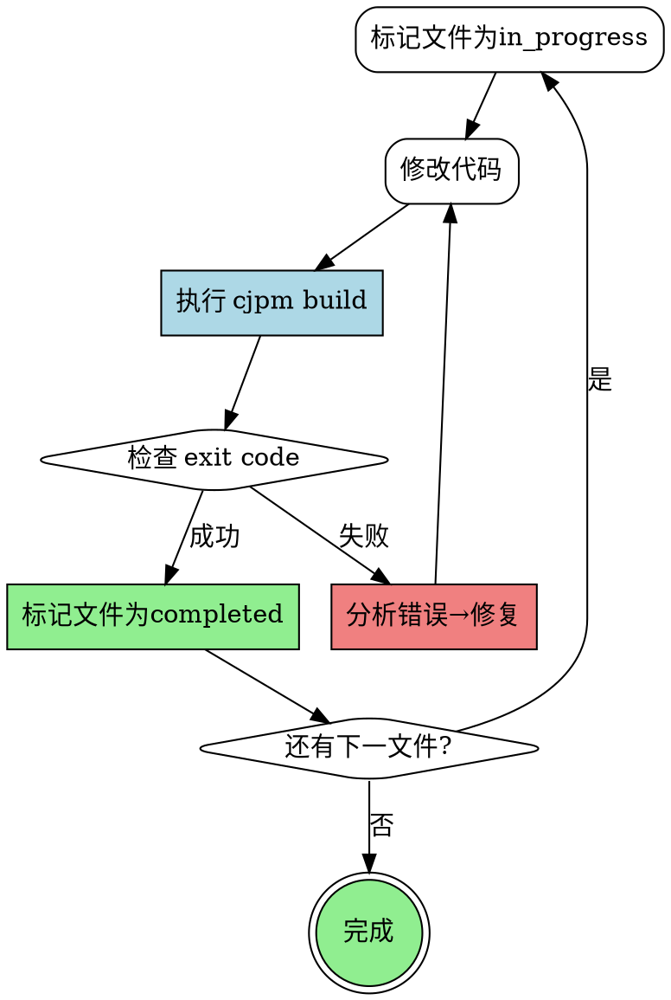

# Compilation & Iterative Fixing

## 🔴 开始前：创建文件级TODO清单

**Step 4开始时，必须创建文件级TODO清单：**

```
=== 编译修正 TODO 清单 ===
输出目录: <output_dir>

## 依赖层级分析

### 第1层（无依赖）
- [ ] common/Constants.cj
- [ ] common/utils/Helper.cj

### 第2层（依赖第1层）
- [ ] service/BaseService.cj (依赖: Helper.cj)

### 第3层（依赖第2层）
- [ ] service/UserService.cj (依赖: BaseService.cj)
- [ ] service/DataService.cj (依赖: BaseService.cj)

### 第4层（入口）
- [ ] main/Main.cj (依赖: UserService, DataService)

## 修复顺序
按层级从低到高：第1层 → 第2层 → 第3层 → 第4层
```

## Core Principle: Modify-Compile Loop

**铁律：修改 → 编译 → 检查 → 更新状态（不可跳过）**



## 🔴 关键规则

**cjpm命令必须在项目根目录（包含cjpm.toml）下执行：**

```bash
# 正确 ✅
cd <output_dir> && cjpm build

# 错误 ❌
cjpm build  # 当前目录无cjpm.toml
```

## 依赖分析与TODO创建

**1. 分析依赖关系：**
```bash
Grep: pattern="^import" path="<output_dir>" glob="*.cj"
```

**2. 使用TodoWrite创建任务清单：**

```json
[
  {"subject": "修复 common/Constants.cj", "status": "pending", "activeForm": "修复 Constants.cj"},
  {"subject": "修复 common/utils/Helper.cj", "status": "pending", "activeForm": "修复 Helper.cj"},
  {"subject": "修复 service/BaseService.cj", "status": "pending", "activeForm": "修复 BaseService.cj", "metadata": {"depends": ["Helper.cj"]}},
  {"subject": "修复 service/UserService.cj", "status": "pending", "activeForm": "修复 UserService.cj", "metadata": {"depends": ["BaseService.cj"]}},
  {"subject": "修复 service/DataService.cj", "status": "pending", "activeForm": "修复 DataService.cj", "metadata": {"depends": ["BaseService.cj"]}},
  {"subject": "修复 main/Main.cj", "status": "pending", "activeForm": "修复 Main.cj", "metadata": {"depends": ["UserService.cj", "DataService.cj"]}},
  {"subject": "整体编译验证", "status": "pending", "activeForm": "执行整体编译验证"}
]
```

## 任务中断与恢复

**检测中断状态：**
```
检测到未完成的编译任务:
- 输出目录: cangjie_output
- 已完成: Constants.cj, Helper.cj, BaseService.cj
- 当前进行中: UserService.cj
- 待完成: DataService.cj, Main.cj, 整体验证

上次错误: Type 'ArrayList' not found in UserService.cj:15

是否继续修复 UserService.cj？(y/n)
```

**恢复流程：**
1. 读取TodoList，找到第一个非completed任务
2. 如果有in_progress任务，从该任务继续
3. 如果全是pending，按依赖顺序开始第一个

## Compilation Process

**逐文件修复流程：**

```bash
# 1. 标记当前文件为 in_progress
# 2. 修复代码
# 3. 编译验证
cd <output_dir> && cjpm build

# 4. 检查结果
echo $?  # 0=成功

# 5. 成功则标记 completed，失败则继续修复
```

**常见问题处理：**

| 问题 | 解决方案 |
|------|----------|
| cjpm.toml不存在 | 检查输出目录是否正确 |
| 依赖下载失败 | `cjpm update` |
| 编译缓存问题 | `cjpm clean && cjpm build` |
| 缺少外部依赖 | 在`adapters/`创建mock接口 |

## External Dependency Mock

对于项目依赖的外部库API，创建mock接口：

```
<output_dir>/
├── adapters/
│   ├── AndroidAdapter.cj    # Android API mock
│   └── ThirdPartyLib.cj     # 第三方库mock
└── src/
```

```cj
// adapters/ThirdPartyLib.cj
public class ThirdPartyLib {
    public static func getInstance(): ThirdPartyLib {
        return ThirdPartyLib()  // 占位实现
    }
}
```

## Iteration Record Format

**每次修复记录：**

```
=== 修复记录 ===
【文件】: service/UserService.cj
【状态】: in_progress → completed
【轮次】: 3
【修改】: 添加 import std.collection.ArrayList
【编译】: cd cangjie_output && cjpm build → 成功 ✓
【时间】: 2024-03-04 22:30:00
```

## 最终验证

**所有文件标记completed后，执行整体验证：**

```bash
cd <output_dir> && cjpm build
echo $?  # 必须 = 0
```

**成功后更新状态：**
- 整体编译验证 → completed
- 返回主workflow，继续 Step 5
