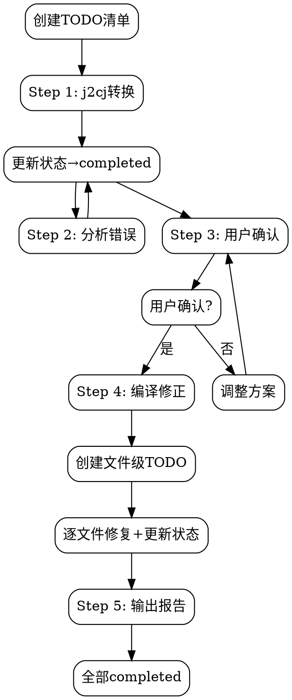

# Translation Workflow

**重要：此工作流程必须严格执行，不可跳过任何步骤。**

## 🔴 任务启动：创建TODO清单

**翻译开始时，必须创建持久化TODO清单：**

```
=== Java2Cangjie 翻译任务 ===
项目: <project_name>
源目录: <java_source_dir>
输出目录: <output_dir>
开始时间: <timestamp>

## TODO 清单

### Phase 1: 初始化
- [ ] Step 1.1: 执行j2cj转换
- [ ] Step 1.2: 验证输出目录结构

### Phase 2: 错误分析
- [ ] Step 2.1: 查找所有<--标记
- [ ] Step 2.2: 分类错误类型
- [ ] Step 2.3: 查找对应API文档
- [ ] Step 2.4: 制定修改方案

### Phase 3: 用户确认
- [ ] Step 3.1: 展示修改方案
- [ ] Step 3.2: 获取用户确认

### Phase 4: 编译修正
- [ ] Step 4.1: 分析依赖关系
- [ ] Step 4.2: 创建文件级TODO清单
- [ ] Step 4.3: 按依赖顺序修复（详见compilation skill）
- [ ] Step 4.4: 整体编译验证

### Phase 5: 报告
- [ ] Step 5.1: 生成转换报告

## 当前状态
当前步骤: Step 1.1
当前文件: N/A
```

**使用TodoWrite创建任务：**
```json
[
  {"subject": "j2cj转换", "status": "pending", "activeForm": "执行j2cj转换"},
  {"subject": "错误分析", "status": "pending", "activeForm": "分析翻译错误"},
  {"subject": "用户确认", "status": "pending", "activeForm": "等待用户确认"},
  {"subject": "编译修正", "status": "pending", "activeForm": "编译并修正错误"},
  {"subject": "生成报告", "status": "pending", "activeForm": "生成转换报告"}
]
```

## 任务中断与恢复

**如果任务中断，恢复流程：**

1. **检查上次状态**：
   - 查看TodoList确认当前进度
   - 读取最近完成的任务

2. **恢复执行**：
   - 从第一个 `pending` 或 `in_progress` 任务继续
   - 跳过已完成的 `completed` 任务

3. **状态同步**：
   ```
   检测到未完成的翻译任务:
   - 项目: MyJavaProject
   - 当前步骤: Step 4.3 (编译修正)
   - 已完成: j2cj转换, 错误分析, 用户确认
   - 待完成: 编译修正, 生成报告

   是否继续执行？(y/n)
   ```

## Step 1: j2cj转换

**标记 Step 1.1 为 in_progress**

```bash
java --patch-module jdk.compiler=j2cj_tool/j2cj.jar \
  -m jdk.compiler/com.excelsior.j2cj.main.Main \
  -d <output_dir> --mode codestyle <java_files>
```

**Options**:
| Option | Description |
|--------|-------------|
| `-d <dir>` | 输出目录（包含cjpm.toml） |
| `-cp <path>` | Java classpath |
| `--mode <mode>` | codestyle（推荐）或 semantic |

**完成后：标记 Step 1.1, 1.2 为 completed**

## Step 2: 分析错误

**标记 Step 2.1 为 in_progress**

**查找j2cj标记的问题**:
```bash
Grep: pattern="<--" path="<output_dir>" glob="*.cj"
```

**错误分类** (Step 2.2):
| 类型 | 示例 | 处理方式 |
|------|------|----------|
| 类型未找到 | `Type 'ArrayList' not found` | 添加import |
| 方法未找到 | `Method 'toString' not found` | 自定义实现 |
| 语法不支持 | `synchronized not supported` | 改用等效语法 |
| 泛型问题 | `Generic wildcard not supported` | 重写泛型 |

**查找文档** (Step 2.3-2.4):
详见 [reference](../reference/SKILL.md) skill

**完成后：标记 Step 2.1-2.4 为 completed**

## Step 3: 用户确认

**标记 Step 3.1 为 in_progress**

**必须等待用户确认！** 展示修改方案后，记录用户反馈。

**完成后：标记 Step 3.1, 3.2 为 completed**

## Step 4: 编译修正

**标记 Step 4.1 为 in_progress**

**详见 [compilation](../compilation/SKILL.md) skill**

此步骤会创建细粒度的文件级TODO清单，每个文件修复完成后更新状态。

## Step 5: 输出报告

**标记 Step 5.1 为 in_progress**

```
========================================
      Java to Cangjie 转换报告
========================================

翻译统计:
  Java文件: N
  Cangjie文件: N

错误修正统计:
  修正轮次: N
  修复文件: N

最终状态: 成功
========================================
```

**完成后：标记所有任务为 completed**

## Flowchart


