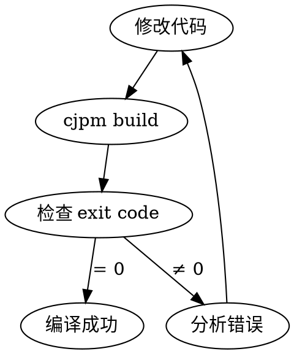

# Translation Workflow (Detailed)

**完整翻译流程 - 从 j2cj 转换到错误修复**

## Phase 1: j2cj Translation

### 命令格式
```bash
java --patch-module jdk.compiler=j2cj_tool/j2cj.jar \
     -m jdk.compiler/com.excelsior.j2cj.main.Main \
     -d <output_dir> \
     -s <java_src_path> \
     -mode codestyle \
     @<filelist>
```

### 步骤
```bash
# 1. 生成文件列表
cd /path/to/java/project
find src/main/java -name "*.java" -type f > /tmp/java_files.txt

# 2. 执行翻译
java --patch-module jdk.compiler=<skill_dir>/j2cj_tool/j2cj.jar \
     -m jdk.compiler/com.excelsior.j2cj.main.Main \
     -d ./cangjie_output \
     -s ./src/main/java \
     -mode codestyle \
     @/tmp/java_files.txt
```

### 输出结构
```
<output_dir>/
└── <root_package>/        # 如 net, com
    ├── cjpm.toml          # 包配置
    └── src/
        └── <package>/     # 按包名组织
```

## Phase 2: Error Analysis

### 查找 j2cj 标记
```bash
Grep: pattern="<--" path="<output_dir>" glob="*.cj"
```

### 常见标记类型
- `Missing mapping for java.xxx` → 需要找 Cangjie 对应 API
- `Java keyword 'xxx' not supported` → 需要语法转换
- `Generic wildcard` → 需要泛型改写

### 文档查找顺序
1. `docs/extra/` - 基础类型
2. `docs/libs/std/` - 标准库 API
3. `docs/manual/` - 语言特性

## Phase 3: Dependency Analysis

### 分析依赖
```bash
Grep: pattern="^import" path="<output_dir>" glob="*.cj"
```

### 生成修复顺序
1. 无依赖文件（叶子节点）
2. 只依赖第1层的文件
3. 依赖第2层的文件
4. ...以此类推

## Phase 4: Fix-Compile Loop



### 执行规则
- **每次修改后必须立即编译**
- **禁止批量修改后统一编译**
- 编译目录必须是包含 `cjpm.toml` 的目录

### 编译命令
```bash
cd <output_dir>/<root_package> && cjpm build
echo $?  # 0 = 成功
```

## Phase 5: Output Report

```
翻译统计:
  Java文件: N
  Cangjie文件: M
  转换率: X%

错误修正统计:
  初始错误: N
  修正轮次: M
  未解决: K
```
